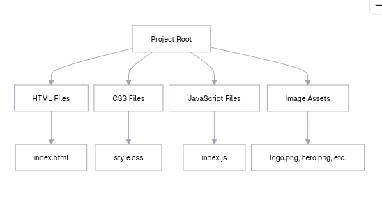

### EduVista - Modern Educational Platform Documentation

I'll create comprehensive documentation for your EduVista educational platform project. This documentation will help you understand the structure, components, and functionality of the website.

## Project Overview

EduVista is a modern educational platform designed to provide online learning experiences. The website features a clean, responsive design with multiple sections showcasing courses, instructors, testimonials, and more.

## Project Road map



## Key Components

The website consists of several key components:

## Header and Navigation

The header includes the logo, navigation menu, dark mode toggle, and authentication buttons. On mobile devices, it collapses into a hamburger menu.

<header className="py-4 px-4 md:px-8 lg:px-16 shadow-sm dark:border-b border-gray-700 sticky top-0 bg-white/90 dark:bg-dark/90 backdrop-blur-sm z-50 transition-colors duration-300">
  {/* Logo, navigation, dark mode toggle, and auth buttons */}
</header>

### Hero Section

The hero section features a headline, subheading, call-to-action buttons, and a hero image with floating elements.

<section className="py-16 md:py-24 px-4 md:px-8 lg:px-16 bg-secondary dark:bg-dark relative overflow-hidden">
  {/* Hero content with CTA buttons and image */}
</section>

## Features Section

Displays key features of the platform with icons, headings, and descriptions.

<section className="py-20 px-4 md:px-8 lg:px-16">
  <div className="container mx-auto">
    <div className="grid grid-cols-1 md:grid-cols-3 gap-8">
      {/* Feature cards */}
    </div>
  </div>
</section>
->same process all section.

## Styling

The project uses Tailwind CSS for styling with custom CSS for special effects:

### Custom CSS Classes

- `gradient-bg`: Creates a gradient background
- `gradient-text`: Creates gradient text
- `card-hover`: Adds hover effects to cards
- `animate-fadeIn`: Fade-in animation
- `animate-slideIn`: Slide-in animation
- `animate-float`: Floating animation
- `shine`: Adds a shine effect to buttons

### Dark Mode

The website supports dark mode with a toggle button. Dark mode styles are applied using Tailwind's `dark:` variant.

```javascript
// Dark mode toggle functionality
document.getElementById("theme-toggle").addEventListener("click", function () {
  document.documentElement.classList.toggle("dark");
  localStorage.setItem(
    "theme",
    document.documentElement.classList.contains("dark") ? "dark" : "light"
  );
});
```

## Responsive Design

The website is fully responsive with different layouts for mobile, tablet, and desktop screens:

- Mobile: Single column layout with hamburger menu
- Tablet: Two-column layout for some sections
- Desktop: Multi-column layout with expanded navigation

## JavaScript Functionality

The main JavaScript functionality includes:

1. Dark mode toggle
2. Mobile menu toggle
3. Animations on scroll
4. Interactive elements

## Implementation Guide

### 1. Setting Up the Project

Create the following folder structure:

eduvista/
├── css/
│ └── style.css
├── js/
│ └── index.js
├── images/
│ ├── logo.png
│ ├── hero.png
│ └── ... (other images)
└── index.html

## Browser Compatibility

The website is compatible with modern browsers:

- Chrome (latest)
- Firefox (latest)
- Safari (latest)
- Edge (latest)

## Performance Optimization

To optimize performance:

1. Compress and optimize images
2. Minify CSS and JavaScript
3. Use responsive images with appropriate sizes
4. Implement lazy loading for images
5. Consider using a CDN for assets

## Deployment

To deploy the website:

1. Upload all files to your web hosting server
2. Ensure proper file permissions
3. Configure your domain to point to the hosting server
4. Test the website on different devices and browsers
